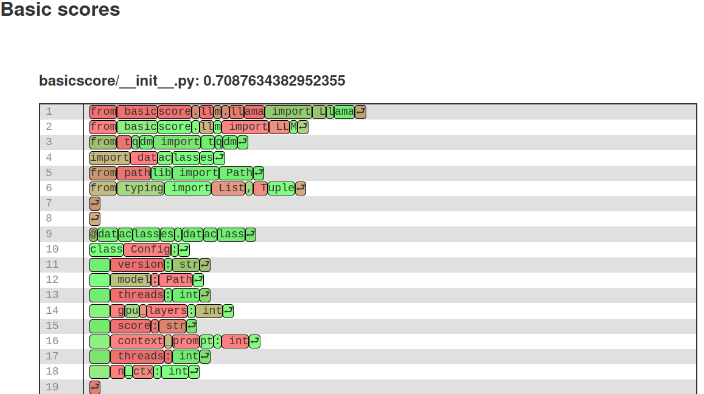

# Basic Score
How basic is that file?

Measure how unsurprising text is by asking an LLM, unsurprising is roughly the
double negation of probable, and large language models just predict the next
token. 



By feeding the text through an LLM and inspecting the token probabilities for
the *known* next character basic score generates the probabilities for all
tokens in your text.

## Why would you want to do that?
While I don't think this is sufficient, the main idea is to give a third party
opinion for code. I'm currently working on evaluating the idea by comparing
relative scores with third party code bases and adding noise to them.

Once the evaluation setup is good I'll implement a RAG loop to create better
contexts, to see if I can get code convention violations to penalize the score.

Besides that this can potentially detect LLM generated output. 

## Installation
For CPU inference it's easy:

```
pip install basicscore
```

For GPU inference you must force reinstall [llama-cpp-python](https://github.com/abetlen/llama-cpp-python#installation-from-pypi)

for example:
```
CMAKE_ARGS="-DLLAMA_CUBLAS=on" pip install llama-cpp-python --force-reinstall --upgrade --no-cache-dir
```

## Usage
Typical usage:
```
basicscore --model model.gguf --gpu-layers 50 --html-out=basicscore_file.html file.py
```

However you use a config-file, passed as argument, in `$CWD/.basicscore.json` or
in `$HOME/.config/basicscore/config.json` in falling precedence. There you can
specify all the options for ease of use.

To run it like this:
```
basicscore file.py
```


## Why didn't you use tinygrad?
I tried at first but I could not get acceptable performance on my hardware and
for this to be possible to evaluate I needed to squeeze out more toks/s than
what I could. A lot has happened since I started this project and I'll likely
revisit it later.
